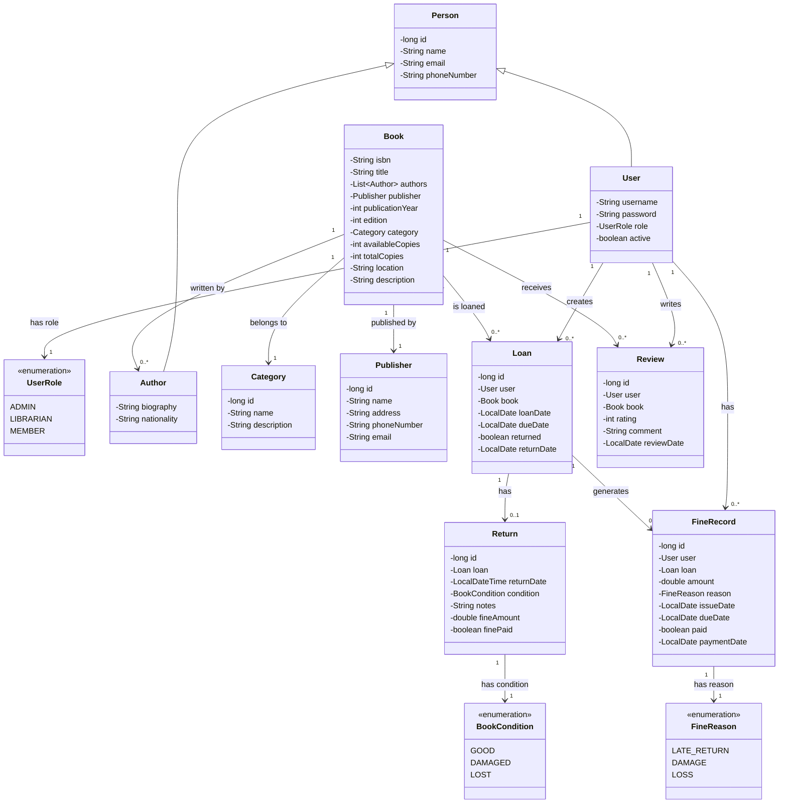

# Diagrama de Clases - Library Management System

```mermaid
classDiagram
    %% Enums
    class UserRole {
        <<enumeration>>
        ADMIN
        LIBRARIAN
        MEMBER
    }

    class BookCondition {
        <<enumeration>>
        GOOD
        DAMAGED
        LOST
    }

    class FineReason {
        <<enumeration>>
        LATE_RETURN
        DAMAGE
        LOSS
    }

    %% Base Classes
    class Person {
        -long id
        -String name
        -String email
        -String phoneNumber
    }

    %% Subclasses
    class User {
        -String username
        -String password
        -UserRole role
        -boolean active
    }

    class Author {
        -String biography
        -String nationality
    }

    %% Entity Classes
    class Book {
        -String isbn
        -String title
        -List~Author~ authors
        -Publisher publisher
        -int publicationYear
        -int edition
        -Category category
        -int availableCopies
        -int totalCopies
        -String location
        -String description
    }

    class Category {
        -long id
        -String name
        -String description
    }

    class Publisher {
        -long id
        -String name
        -String address
        -String phoneNumber
        -String email
    }

    class Loan {
        -long id
        -User user
        -Book book
        -LocalDate loanDate
        -LocalDate dueDate
        -boolean returned
        -LocalDate returnDate
    }

    class Return {
        -long id
        -Loan loan
        -LocalDateTime returnDate
        -BookCondition condition
        -String notes
        -double fineAmount
        -boolean finePaid
    }

    class Review {
        -long id
        -User user
        -Book book
        -int rating
        -String comment
        -LocalDate reviewDate
    }

    class FineRecord {
        -long id
        -User user
        -Loan loan
        -double amount
        -FineReason reason
        -LocalDate issueDate
        -LocalDate dueDate
        -boolean paid
        -LocalDate paymentDate
    }

    %% Inheritance relationships
    Person <|-- User
    Person <|-- Author

    %% Associations
    User "1" --> "0..*" Loan : creates
    User "1" --> "0..*" Review : writes
    User "1" --> "0..*" FineRecord : has

    Book "1" --> "0..*" Author : written by
    Book "1" --> "1" Publisher : published by
    Book "1" --> "1" Category : belongs to
    Book "1" --> "0..*" Loan : is loaned
    Book "1" --> "0..*" Review : receives

    Loan "1" --> "0..1" Return : has
    Loan "1" --> "0..*" FineRecord : generates

    Return "1" --> "1" BookCondition : has condition
    FineRecord "1" --> "1" FineReason : has reason
    User "1" --> "1" UserRole : has role
```
